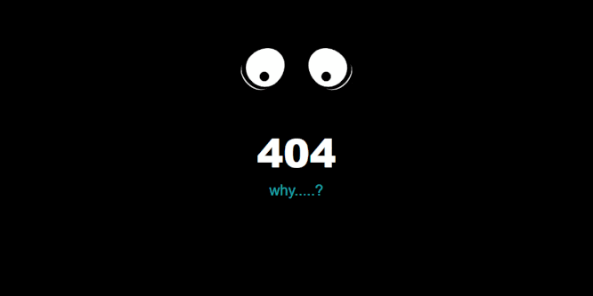
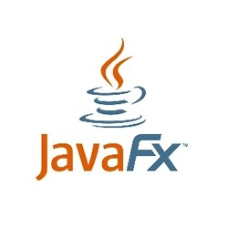
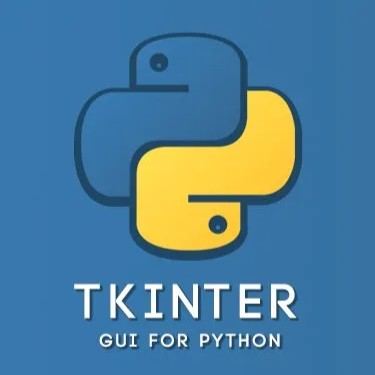
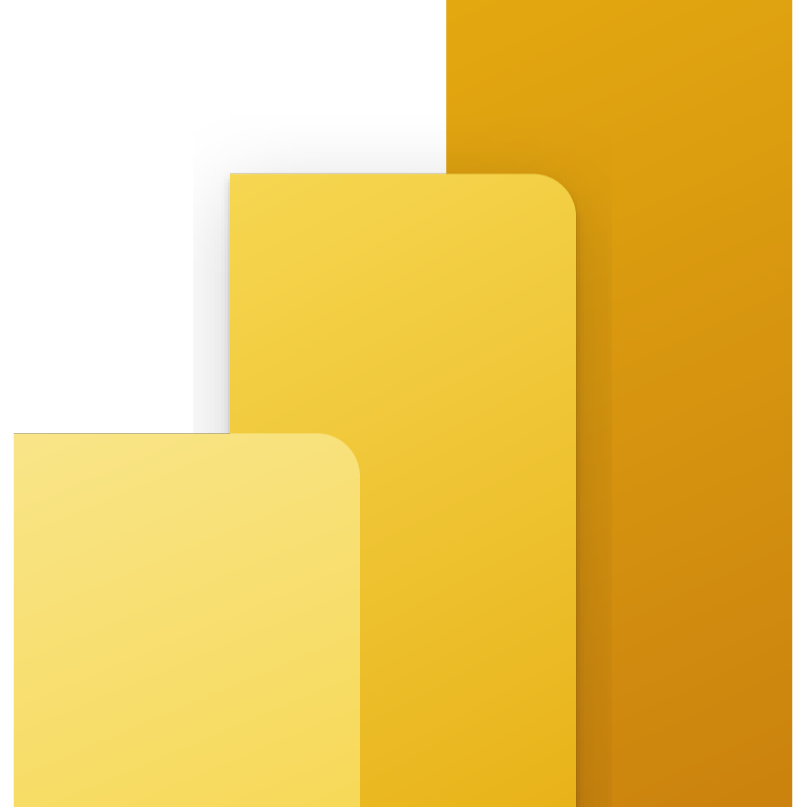

<h1 align="center">
    
</h1>

    

<h3 align="center">A passionate AI/ML enthusiast</h3>

  

<!-- 
  
 -->

- 🌱 I’m currently learning **ML and AI**

- 📫 How to reach me **mylifeasasif@gmail.com**

- ⚡ Fun fact **I'm 21 years old annoying d*ckhead**

## 📱Connect with me:

## 🧠 Programming Skills

  
  
  
  
  
  
  
  

<h2 align="left">⚒️ Languages-Frameworks-Tools ⚒️</h2>
<h3 align="center">💻 Programming Language 💻</h3>

    
     

 
<h3 align="center">📦 Frameworks and Libraries 📦</h3>

    
    
    
    
    
    
      
    
      
    
    
      
    
    
    

 

<h3 align="center">🗄️ Database 🗄️</h3>

    
    
     

 
<h3 align="center">💻 Editing Software 💻</h3>

    
    
    
     

 

<h3 align="center">📊 Data Analytics 📊</h3>

    
    
     

 

<h3 align="center">🛠️ Tools 🛠️</h3>

    
     

 

<h2 align="left">⚡ Stats ⚡</h2>
 

  

   
  

